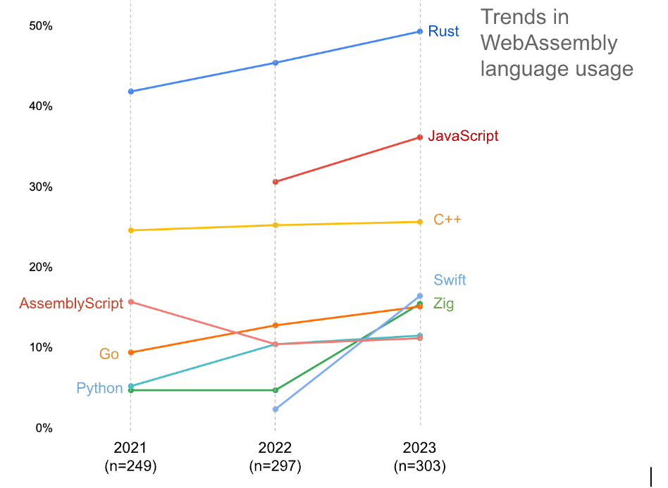

\newpage    

# WebAssembly {#sec:webassembly}
WebAssembly, kurz WASM, ist eine Low-Level-Programmiersprache, die innerhalb des World Wide Web Consortiums (W3C) entwickelt und 2018 zum ersten Mal veröffentlicht wurde. WebAssembly wird in Bytecode dargestellt und ist daher für Menschen schwer zu lesen. Obwohl es nicht vorgesehen ist, dass WebAssembly von Hand geschrieben wird, ist dies durchaus möglich. WebAssembly bietet eine Textdarstellung (`.wat`), die den kompilierten Code in Textform anzeigt. WebAssembly ist ein Kompilierungsziel für verschiedene Sprachen wie Rust, C, C++, Kotlin, Java und viele mehr. Der Programmcode wird in eine `.wasm` Datei kompiliert, die jedoch vom Browser nicht direkt ausgeführt werden kann. Zur Ausführung von WebAssembly wird weiterhin JavaScript benötigt, um die `.wasm` Datei zu laden und auszuführen. Es ist nicht vorgesehen, dass WebAssembly JavaScript ersetzt. Stattdessen sollen die beiden Technologien Hand in Hand arbeiten. WebAssembly ist mittlerweile ein Standard, welche von allen vier wichtigen Webbrowser wie `Chrome, Safari, Mozilla Firefox` und `Microsoft Edge` unterschützt werden [@rossberg_webassembly_2024; @haas_bringing_2017]. 

## Frühere Versuche von Low-Level Code im Internet
WebAssembly ist nicht der erste Versuch, Low-Level-Code im Web zu ermöglichen, um die Performance- oder Sicherheitsvorteile zu nutzen. Eine vergangene Technologie, Microsoft ActiveX, erlaubte es, selbstsignierte x64-Binärdateien im Webbrowser auszuführen. Das Modell scheiterte jedoch daran, dass die Sicherheit nicht auf einem technischen Konstrukt, sondern auf einem Vertrauensmodell beruhte. Native Client war die erste Technologie, die im Web eine Sandboxing-Technik für Maschinencode eingeführt hat. Das System wurde aus technischer Sicht als sicher angesehen, da der Codegenerator das Einhalten spezieller Muster verlangte. Allerdings konnte Native Client nicht auf JavaScript oder der Web-API zugreifen. Emscripten ist ein weiteres Framework, mit dem Anwendungen in C/C++ in JavaScript umgewandelt werden können. Im Laufe der Zeit wurde dies zu `asm.js` weiterentwickelt. Da `asm.js` in JavaScript kompiliert wird, kann es überall dort ausgeführt werden, wo JavaScript läuft (z.B. in Webbrowsern oder Node.js). Allerdings ist `asm.js` von Natur aus an die spezifische Semantik von JavaScript gebunden. Wenn eine neue Funktion in `asm.js` hinzugefügt werden soll, muss auch JavaScript angepasst werden. Java und Flash ermöglichten die Ausführung von Code im Web und waren bereits früh integriert. Allerdings unterstützten sie nicht die gleiche Leistung wie Low-Level-Code und werden aufgrund von Sicherheits- und Performanceproblemen nicht mehr verwendet [@haas_bringing_2017, S. 186].

## Zielsetzung
WebAssembly beschreibt verschiedene Ziele, welche hier aufgeführt werden. Wir werden uns anschauen, warum diese Ziele wichtig sind und wie WebAssembly diese erfüllt [@rossberg_webassembly_2024, S. 1 - 2].

- Fast, safe, and portable semantics
- Efficient and portable representation


[@haas_bringing_2017, S. 185]

## WebAssembly anhand eines Beispiels
Obwohl WebAssembly nicht dazu gedacht ist, von Hand zu programmieren, schreiben wir eine kleine Funktion, um zu verstehen, wie WebAssembly aufgebaut ist. Die Funktion erhält zwei Argumente, `x` und `y`. Danach wird eine neue Variable `z` deklariert und mit dem Ergebnis der Multiplikation von `x` und `y` initialisiert. Anschließend wird `x` zurückgegeben, wenn `x` größer als `z` ist, ansonsten wird der Wert `z` zurückgegeben. In JavaScript würde eine solche Funktion wie in [@lst:wasm_example_code] aussehen.

```js
function foo(x, y) {
  const z = x * y
  if (x > z) { return x } else { return z }  
}
```
: JavaScript Code, welcher in WebAssembly umgeformt wird {#lst:wasm_example_code}

WebAssembly unterteilt alles in Module. In einem Modul werden Funktionen definiert, die zu JavaScript exportiert werden. Eine Funktion definiert Parameter, die durch die Befehle `local.get` abgerufen oder durch `local.set` gesetzt werden können. Die Parameter haben numerische Datentypen, welche wie folgt aussehen:

- `i32 | i64`: 32-bit oder 64-bit Integer
- `f32 | f64`: 32-bit oder 64-bit Float

WebAssembly ist eine stackbasierte Programmiersprache. Alle Befehle werden vom Stack gelesen oder darauf geschrieben. In unserem Beispiel werden zunächst die Parameter `$x` und `$y` in den Stack geladen und anschließend mit dem Befehl `i32.mul` multipliziert. Dieser Befehl nimmt zwei Werte vom Stack, multipliziert sie und speichert das Ergebnis erneut im Stack. Das Ergebnis wird im nächsten Schritt in `$z` gespeichert. Anschließend werden die Variablen `$x` und `$z` erneut in den Stack geladen und mit dem Befehl `i32.gt_s` verglichen. Dieser Befehl ruft zwei Werte aus dem Stack ab und überprüft, ob der erste Wert größer als der zweite Wert ist. In diesem Beispiel wird überprüft, ob `x > z` ist. Das Ergebnis wird erneut auf dem Stack gespeichert. Die Anweisung `if` wird ausgeführt, wenn das Ergebnis der vorherigen Operation `true` ist. Wenn dies zutrifft, wird der Wert von `$x` zurückgegeben. Andernfalls wird `$z` in den Stack geladen. Da die Funktion jetzt beendet ist, wird der oberste Wert vom Stack zurückgegeben, der hier der Wert von `$z` ist [@mdn_understanding_2023].

```wasm
(module
  (export "foo" (func $foo))
  (func $foo (param $x i32) (param $y i32) (param $z i32) (result i32)
    local.get $x
    local.get $y
    i32.mul
    local.set $z
    local.get $x
    local.get $z
    i32.gt_s
    if
      local.get $x
      return
    end
    local.get $z
  )
)
```
: WebAssmebly Code in Textformat {#lst:wasm_wat_code}

## Rust für WebAssembly
Mehrere Programmiersprachen können zu WebAssembly kompiliert werden. Unter diesen ist Rust besonders beliebt für die Entwicklung von WebAssembly-Anwendungen. Dies wird durch eine Studie von Scott Logic bestätigt [@eberhardt_state_2023]. Auch andere Quellen empfehlen die Nutzung von Rust für WebAssembly [@fermyon_webassembly_2022; @fitzgerald_oxidizing_2018]. 

[...]

Da Rust so populär in der für die verwendung von WebAssembly ist, wird in dieser Arbeit die Vergleichsalgorithmen mit Rust für WebAssembly implementiert.

{#fig:wasm-lang-trends width=80%}


