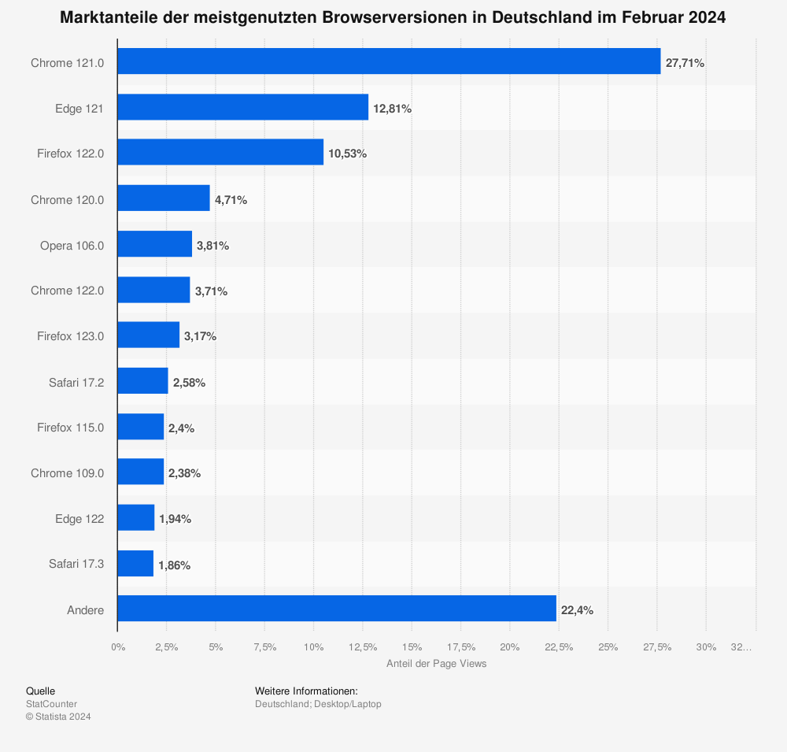

# Webbrowser
Das Internet besteht aus verschiedenen Ressourcen, die über eine `Uniform Resource Identifier` (URI) abgerufen werden können. Diese Ressourcen bestehen aus Dokumenten, die in `HyperText Markup Language` (HTML) geschrieben sind. HTML erlaubt es, Texte anzuzeigen oder in einem Dokument auf weitere HTML-Dokumente zu verweisen. Neben HTML-Dokumenten können auch andere Ressourcen wie Bilder, Audio- und Videoclips sowie JavaScript- und CSS-Dateien geladen werden. Ein Webbrowser ist ein Programm, das Ressourcen von einem Server über eine URI abruft und das HTML-Dokument darstellt. Die Datenübertragung erfolgt über das `HyperText Transfer Protocol` (HTTP). Wenn im HTML-Dokument JavaScript-Dateien definiert sind, werden diese im Webbrowser interpretiert und in Echtzeit kompiliert (Just-in-Time-Kompilierung) [@grosskurth_reference_2006, S. 1 - 2].

## Geschichte
1990 entwickelte Tim Berners-Lee bei der Europäischen Organisation für Nuklearforschung (CERN) den ersten Internet-Server `httpd` sowie den ersten Web-Client `WorldWideWeb`. Berners-Lee wird auch deshalb oft als der Vater des Internets bezeichnet. Der von ihm entwickelte Web-Browser bot eine grafische Darstellung von Dokumenten und war mit einem Texteditor für HTML-Dateien ausgestattet [@bizer_linked_2009]. Gleichzeitig wurde an der University of Kansas an einem textbasierten Webbrowser namens Lynx gearbeitet. Lynx wurde für das UNIX-System entwickelt und erstmals 1993 veröffentlicht [@grosskurth_reference_2006, Seite 2]. 1993 wurde das Internet bereits von Universitäten, Regierungen und Privatfirmen genutzt, welche alle die Vorteile und Möglichkeiten des Internets erkannten. In dem selben Jahr entwickelte Marc Andreessen am National Center for Supercomputing Applications (NSCA) den allerersten populären Webbrowser Mosaic. Im darauf folgendem Jahr gründete Andreessen Netscape und brachte den Webbrowser Netscape-Navigator auf dem Markt [@mozilla_geschichte_nodate]. 1995 brachte Microsoft den Internet Explorer auf den Markt. Der Browser basiert auf dem alten Code von Mosaic. Die Veröffentlichung löste einen "Krieg" zwischen Microsofts Internet Explorer und Netscape aus, der auch als `Browserkrieg` bekannt ist. Microsoft begann, den Internet Explorer als Standardbrowser in das Betriebssystem Windows zu integrieren und dominierte somit den Markt. Netscape veröffentlichte seinen Browser als Open-Source-Projekt unter dem Namen Mozilla, aus dem dann der Mozilla Firefox entstand. Im Laufe der Zeit traten weitere Konkurrenten auf den Markt, wie zum Beispiel Opera, Safari und Google Chrome [@grosskurth_reference_2006, S. 2]. Die aktuelle Verteilung der Webbrowser kann in [@fig:webbrowser-statistic] von [@statcounter_marktanteile_2024] entnommen werden.

{#fig:webbrowser-statistic width=60%}

## Webanwendungen {#sec:webanwendungen}
Eine Webanwendung ist eine Software, welche im Webbrowser ausgeführt wird. Meistens ist die Programmiersprache in einer Webanwenung JavaScript oder TypeScript. Entwickler erkannten früh die Vorteile des Client-Server-Modells. Es wurde schnell klar, dass der Webbrowser als Benutzeroberfläche für Anwendungen auf dem Server oder für lokale Anwendungen dienen kann. Durch die Entwicklung von JavaScript war es nun möglich, nicht nur statische HTML-Dokumente anzuzeigen, sondern auch dynamisch mit ihnen zu interagieren [@jazayeri_trends_2007]. Das Client-Server-Modell ermöglicht die Kommunikation zwischen Endgeräten wie Computern und Smartphones über ein Netzwerk mit einem zentral positionierten Server, um die benötigten Daten zu erhalten. Die Kommunikation findet dabei nicht direkt zwischen den Endgeräten statt. Es gibt zwei grundlegende Arten von Webanwendungen: clientseitige und serverseitige. Clientseitige Webanwendungen werden im Browser des Endbenutzers ausgeführt. Der Client lädt dabei die benötigten Ressourcen wie HTML, CSS und JavaScript vom Server herunter und führt die Geschäftslogik sowie die Benutzeroberfläche direkt im Browser aus. Typische Beispiele für clientseitige Anwendungen sind Single-Page-Anwendungen (SPAs). Hierbei wird die gesamte Anwendung beim ersten Laden der Seite geladen und es werden nur noch Daten nachgeladen, ohne dass die Seite neu geladen werden muss [@mikowski_single_2014]. Im Gegensatz dazu wird bei serverseitigen Webanwendungen die Geschäftslogik auf dem Server ausgeführt. Der Server bearbeitet die Anfragen des Clients, führt die notwendigen Berechnungen durch und sendet das Ergebnis in Form von HTML, CSS und anderen Ressourcen zurück. Dadurch wird eine bessere Trennung von Präsentation und Logik ermöglicht und die Sicherheit erhöht, da sensible Operationen auf dem Server ausgeführt werden, wo sie weniger anfällig für Manipulation sind. Traditionell bieten serverseitige Anwendungen oft eine höhere Leistung, da der Server über leistungsstarke Ressourcen verfügt und die Berechnungen zentralisiert ausgeführt werden. Zudem bieten sie eine sicherere Umgebung, da sensible Daten nicht im Browser des Benutzers liegen [@cloudflare_was_nodate]. WebAssembly soll es jedoch ermöglichen, die Performancevorteile von serverseitigen Anwendungen auf die Clientseite zu übertragen. Durch die Ausführung von kompiliertem Code direkt im Browser können komplexe Berechnungen und Anwendungen mit hoher Leistung ausgeführt werden. Dies ist ähnlich wie bei serverseitigen Anwendungen. 

## WebAssembly in Webanwendungen
Einige Webanwendungen, wie zum Beispiel Figma, haben bereits auf WebAssembly umgestellt. Figma ist eine Anwendung, die im Webbrowser läuft und ein Tool zur Erstellung von Benutzeroberflächenprototypen bietet. Zuvor nutzte Figma eine Kompilierung von C++ mit asm.js. Berichten zufolge hat Figma eine dreifach bessere Ladezeit mit WebAssembly im Vergleich zu asm.js festgestellt. Dies resultiert aus mehreren Vorteilen der Kompilierung von C++ zu WebAssembly im Gegensatz zu C++ zu asm.js. WebAssembly ermöglicht eine schnellere Ausführung von komplexem Code. Moderne Browser optimieren den Code besser. Die Darstellung des Maschinencodes in WebAssembly ist im Vergleich zu asm.js kompakter, was zu schnelleren Ladezeiten führt [@wallace_figma_2017]. WebAssembly bietet eine effizientere und direkt ausführbare Darstellung des Codes. Das kann insbesondere bei umfangreichen Anwendungen wie Figma zu deutlichen Leistungsverbesserungen führen.
