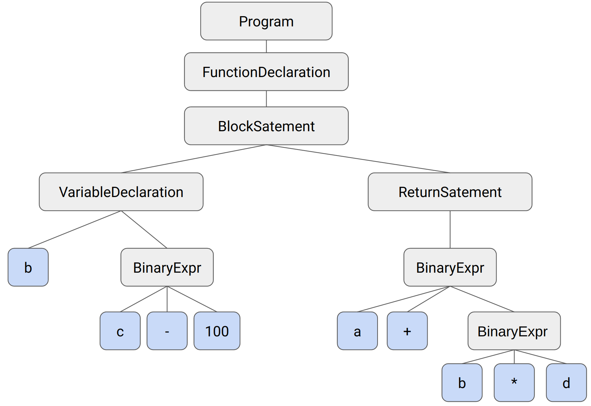

# JavaScript Engine {#sec:js-engine}
Die JavaScript-Engine ist Bestandteil jedes modernen Browsers. Da JavaScript eine dynamische Programmiersprache ist, werden Variablen, Typen und andere Elemente in Echtzeit interpretiert. Programme, die zur Laufzeit interpretiert werden müssen, sind von Natur aus langsamer als Programme, die im Voraus kompiliert wurden. Eine JavaScript Engine enthält einen Just-In-Time-Compiler, der den JavaScript Code in Echtzeit kompiliert. Zusätzlich enthält eine JavaScript Engine weitere Komponenten wie Parser, Garbage Collector und WebAssembly Compiler. Derzeit gibt es drei verschiedene JavaScript-Engines, die in gängigen Webbrowsern zum Einsatz kommen (siehe [@fig:webbrowser-statistic]): 

- V8 von Google
- SpiderMonkey von Mozilla
- JavaScriptCore in WebKit von Apple

Die JavaScript-Engine V8 von Google ist Bestandteil von Google Chrome, Opera [@lawson_300_2013], Microsoft Edge [@microsoft_download_nodate] und vielen weiteren auf Chromium basierenden Webbrowsern. Microsoft Edge basierte auf die JavaScript Engine Chakra, wechselte aber zur V8 Engine von Google. Darüber hinaus wird die Engine nicht nur in Browsern verwendet, sondern auch in Node.js und CouchDB eingesetzt. SpiderMonkey wird vorrangig im Webbrowser Mozilla Firefox eingesetzt. Webkit und die dazugehörige JavaScript Engine JavaScriptCore kommen in den Apple Webbrowsern Safari auf macOS und iOS zum Einsatz. Die Entwicklung der JavaScript-Engine spielte eine wichtige Rolle im Browserkrieg, da eine schnellere und flüssigere Benutzererfahrung ein wichtiger Wettbewerbsfaktor war [@bernhard_jit-picking_2022, S. 351].

## Just-In-Time Compiler
 Wie zuvor in [@sec:javascript] erwähnt, handelt es sich bei JavaScript um eine dynamisch typisierte Programmiersprache. Im Verlauf des Programmcodes können Variablen unterschiedliche Datentypen zugewiesen werden. Das kann ein Vorteil in der Programmierung sein, erschwert jedoch den Kompiliervorgang, der den Programmcode in eine für den Computer verständliche Form, wie Maschinencode, bringt. Just-In-Time Compiler, kompilieren nur den aktuellen Code, der gerade benötigt wird, und führen diesen aus. Wenn dieser Code erneut benötigt wird, wird er erneut kompiliert. Das Gegenstück zum JIT-Compiler sind Ahead-of-Time-Compiler (AOT). Hier wird der gesamte Quellcode zuerst kompiliert und eine ausführbare Datei erstellt, die dann ausgeführt werden kann. Ein Beispiel hierfür sind Rust und Webassembly. Beide müssen vor der Ausführung vollständig kompiliert werden [@hinkelmann_understanding_2017].

## Grundlegender Aufbau
Alle drei JavaScript Engines sind prinzipiell gleich aufgebaut und enthalten weitgehend die gleichen Komponenten, allerdings sind diese Komponenten unterschiedlich in die JavaScript Engine integriert. Alle drei Engines haben unterschiedliche Implementierungen für Komponenten wie Parser, Interpreter, JIT-Compiler, Garbage Collector und einen Compiler für WebAssembly [@v8_documentation_nodate; @mozilla_spidermonkey_nodate; @apple_javascriptcore_nodate].

Alle modernen JavaScript-Engines verfügen über mindestens zwei JIT-Compiler: einen Basis-Kompilierer (Baseline Compiler) und einen Optimierungskompiler (Optimized Compiler). Der JavaScript Code wird dabei umgewandelt und vom Baseline Compiler ausgeführt, wobei Informationen gesammelt werden. Wenn erkannt wird, dass eine Funktion häufig aufgerufen wird, wird sie durch den Optimized Compiler optimiert. In V8 übernimmt `Ignition` die Aufgabe des Baseline Compilers und `TurboFan` die Aufgabe als Optimized Compiler [@hinkelmann_understanding_2017]. In SpiderMonkey wird der Optimized Compiler `WrapMonkey` [@mozilla_spidermonkey_nodate] genannt, während es in JavaScriptCore zwei Optimized Compiler gibt: `DFG (Data Flow Graph) JIT` und `FTL (Faster Than Light) JIT` [@apple_javascriptcore_nodate].

Alle drei Engines haben neben einem JIT-Compiler auch einen WebAssembly-Kompilierer, um WebAssembly auszuführen. In V8 übernimmt dies `Liftoff`, in SpiderMonkey `RabaldrMonkey` und `BaldrMonkey` und in Webkits JavaScriptCore `BBQ (Build Bytecode Quickly)` und `OMG (Optimized Machine-code Generator)` [@backens_liftoff_2018; @mozilla_spidermonkey_nodate; @bastien_assembling_2017].

## Detaillierter Aufbau der V8 JavaScript Engine
[@fig:v8-pipeline] zeigt die V8 Kompilierungspipeline. Der JavaScript Code wird zuerst vom Parser in einen `Abstract Syntax Tree` umgewandelt. Dieser `Abstract Syntax Tree` wird vom Interpreter `Ignition` in Bytecode umgewandelt. Der Bytecode wird bei Bedarf von `TurboFan` in optimierten Maschinencode umgewandelt. 

{#fig:v8-pipeline width=80%}

In diesem Kapitel wird die Funktionsweise der JavaScript-Engine V8 vorgestellt. Ziel ist es, ein besseres Verständnis dafür zu vermitteln, wie ein Webbrowser JavaScript-Code verarbeitet und optimiert, um die Performance zwischen JavaScript und WebAssembly zu analysieren. Es wird der JavaScript-Code analysiert, wie er durch die JavaScript-Engine V8 durchläuft, welcher in [@lst:v8_demo_code] einzusehen ist.

```js
function foo(a, b, c) {
	const d = c - 100;
	return a + b * d;
}

foo(5, 2, 150) // Aufruf
```
: Beispiel Funktion für V8 {#lst:v8_demo_code}

### Parser
Um JavaScript ausführen zu können, muss der in JavaScript geschriebene Code zunächst geparst werden, damit V8 ihn verstehen kann. Der Parser ist die erste Anlaufstelle, wenn eine JavaScript-Datei im Webbrowser ausgeführt wird. Zu Beginn wird der JavaScript Code in einen `Abstract Syntax Tree` (AST) umgewandelt. Ein AST ist eine syntaktische Struktur vom JavaScript Quellcode. Anschließend wird der AST von der Komponente Ignition in Bytecode umgewandelt. Es ist wichtig, dass das Parsen schnell und performant verläuft, da V8 erst nach der Kompilierung des JavaScript Codes gestartet werden kann und der AST für die Kompilierung des Codes benötigt wird [@verwaest_blazingly_2019].

Da nicht alle Funktionen im Quellcode direkt beim Start benötigt werden, kommt hier ein `Lazy Parser` zum Einsatz. Somit wird nicht der komplette Quellcode als AST geparst, sondern nur die zum Start benötigten Funktionen. Der `Lazy Parser` entscheidet, ob eine Funktion übersprungen werden kann. Wird eine Funktion übersprungen, wird sie vorbereitet, damit sie bei Bedarf vollständig geparst werden kann. Nach erfolgreichem Parsen des Quellcodes wird der AST an Ignition weitergegeben [@verwaest_blazingly_2019-1].

Der AST, der von der oben genannten Funktion [@lst:v8_demo_code] erzeugt wird, kann mit dem V8 Developer Tool `d8`^[https://v8.dev/docs/d8] erzeugt werden. In `d8` können JavaScript-Funktionen ausgeführt und mit speziellen Debug-Parametern analysiert werden. Der Parameter `--print-ast` gibt einen Überblick über den erzeugten AST, welcher in [@fig:ast] visualisiert wurde. Die vollständige Ausgabe ist im [Anhang @sec:d8-ast-output] verfügbar.

```bash
$ d8 --print-ast demo.js
[generating bytecode for function: foo]
--- AST ---
. NAME "foo"
. PARAMS
. . VAR (0x55a310d018d0) (mode = VAR, assigned = false) "a"
. . VAR (0x55a310d01950) (mode = VAR, assigned = false) "b"
...
```
: V8 erstellter AST {#lst:ast}

{#fig:ast width=60%}

### Ignition
Ignition ist ein Interpreter, der aus den Informationen des AST Bytecode erzeugt und im Mai 2017 in die V8 Engine integriert wurde. Bytecode ist eine Abstraktion von Maschinencode und wird von einem High-Performance-Interpreter ausgeführt. Es handelt sich dabei um eine Ansammlung von Operationen, die ausgeführt werden. Obwohl der Bytecode für sich optimiert ist, ist seine Ausführung naturgemäß langsamer als die von Maschinencode. V8 überprüft, ob eine Funktion häufig ausgeführt wird. Wenn dies der Fall ist, übernimmt `TurboFan` die Kompilierung und gibt optimierten Maschinencode aus, der performanter als der Bytecode ist. Dieser Schritt ist in Abbildung 
\ref{fig:v8-pipeline} mit einem grünen Pfeil markiert [@hinkelmann_understanding_2017; @v8_firing_2016].

Der Bytecode aus der oben genannten Funktion [@lst:v8_demo_code] kann mit dem Tag `--print-bytecode` von Ignition ausgegeben werden. Die hier dargestellte Ausgabe in [@lst:ignition_bytecode] enthält lediglich den Bytecode der Funktion `foo()`. Die komplette Ausgabe ist im [Anhang @sec:v8-ignition-bytecode] zu sehen.

```bash
$ d8 --print-bytecode demo.js
...
36 S> 0x3cd1000421d4 @    0 : 0b 05             Ldar a2
38 E> 0x3cd1000421d6 @    2 : 45 64 00          SubSmi [100], [0]
	  0x3cd1000421d9 @    5 : c6                Star0
47 S> 0x3cd1000421da @    6 : 0b f9             Ldar r0
60 E> 0x3cd1000421dc @    8 : 3a 04 02          Mul a1, [2]
56 E> 0x3cd1000421df @   11 : 38 03 01          Add a0, [1]
64 S> 0x3cd1000421e2 @   14 : ab                Return
```
: Ignition Bytecode {#lst:ignition_bytecode}

Es gibt hier 7 Schritte, die im Bytecode ausgeführt werden. Ignition besteht aus mehreren Registern, wie `r0, r1, r2, ...`, in denen Werte abgespeichert werden können, sowie einem Akkumulator. Der Akkumulator ist wie ein normales Register, in dem ein Wert abgespeichert wird. Der Bytecode nennt dieses Register jedoch bei einer Operation oft nicht explizit. Zum Beispiel wird im Bytecode `Add a0` der Wert von `a0` mit dem Wert im Akkumulator addiert. Die Parameter, die der Funktion übergeben werden, sind auch in Registern gespeichert, die hier als `a0, a1, a2` bezeichnet werden. Zunächst wird der Wert aus dem Register `a2` durch den Befehl `Ldar` in den Akkumulator geladen. Anschließend wird der Wert im Akkumulator durch `SubSmi [100]` um 100 subtrahiert und erneut im Akkumulator gespeichert. `SubSmi` steht dabei für `Substract small integer`. Dann speichert `Star0` den Wert im Akkumulator im Register `r0`. Register `r0` repräsentiert somit die Variable `d` aus dem JavaScript Code. Der Wert wird durch `Ldar r0` wieder in den Akkumulator geladen. Zunächst wird `Mul a1` ausgeführt, wobei der Wert im Akkumulator mit dem Wert aus dem Register `a1` multipliziert wird. Anschließend wird `Add a0` ausgeführt, wobei der Wert im Akkumulator mit dem Wert von `a0` addiert wird. Schließlich wird `Return` aufgerufen. Dadurch wird der Wert im Akkumulator zurückgegeben und die Funktion beendet [@hinkelmann_understanding_2017].

Durch Ignition wird der JavaScript Code nicht mehr benötigt. Alle Informationen sind im Bytecode enthalten und werden bei Bedarf von `Turbofan` noch weiter optimiert. Dadurch muss der JavaScript Code nicht erneut geparst werden. Zudem benötigt der gesamte Bytecode weniger Speicher als ein kompilierter Maschinencode, was zu einer Reduzierung des Arbeitsspeichers führt [@v8_firing_2016].

### TurboFan
TurboFan ist der Optimierungs-Compiler von V8. Er basiert auf dem "Sea of Nodes"-Konzept [@titzer_digging_2015]. Dabei durchläuft TurboFan mehrere Schritte, die in [@fig:v8-turbofan-pipeline] dargestellt sind. Die Pipeline gliedert sich in die Phasen `Frontend`, `Optimierung` und `Backend`. Im `Frontend`-Bereich wird der Bytecode von Ignition in Graphen umgewandelt, um damit weiterzuarbeiten. Diese Graphen repräsentieren den Code und seine Abhängigkeiten in einer strukturierten Form, ähnlich wie der `Abstract Syntax Tree`. In der Optimierungsphase wird der Code aus der graphischen Darstellung analysiert und optimiert. Die Phasen `Frontend` und `Optimierung` sind nicht an die Systemumgebung gebunden, dieser Schritt läuft auf allen Endgeräten gleich ab. Die `Backend`-Phase hingegen unterscheidet sich von der Architektur des Systems. Hier werden verschiedene Optimierungen auf Maschinenebene durchgeführt bis hin zur Codegenerierung für die spezielle Architektur des Systems. Ein Rechner mit einer x64-Architektur muss hier anders behandelt werden als z.B. eine ARM-Architektur.

{#fig:v8-turbofan-pipeline width=80%}

Mit dem `d8` Developertool lassen sich zusätzliche Parameter in einer JavaScript-Datei anpassen, um zum Beispiel eine Funktion zu makieren, damit diese von TurboFan optimiert wird (siehe [Anhang @sec:v8-opt.js]). Die Ausgabe in [@lst:turbofan-opt-code] zeigt einen Ausschnitt des optimierten Codes aus [@lst:v8_demo_code] von TurboFan. Dabei wird in [@lst:turbofan-opt-code] nur die für diesen Text relevante Ausgabe dargestellt. Eine vollständige Ausgabe ist im [Anhang @sec:v8-turbofan-output] zu finden. Dieser Code ist in x86-64 Assembler geschrieben und wurde auf einem System mit einer x64-Architektur ausgeführt. In diesem Abschnitt wird in der zweiten Zeile `subl rdi,0x64` die gleiche Funktion wie im JavaScript-Code `const d = c - 100` durchgeführt. Dabei wird der Wert `0x64` (entsprechend 100 in Dezimal) vom Wert im Register `rdi` subtrahiert, wobei `subl` verwendet wird. In Zeile 5 wird der Wert aus dem Register `rdi` mit dem Wert aus dem Register `r9` multipliziert (`imull`). Anschließend wird das Ergebnis in Zeile 8 mit dem Wert aus dem Register `r11` addiert (`addl`). Dies entspricht der JavaScript-Funktion `a + b * d` [@meurer_introduction_2017].

```bash
$ d8 --allow-natives-syntax --trace-opt --print-opt-code demo-opt.js
0x7a85e0004096    56  d1ff                 sarl rdi, 1
0x7a85e0004098    58  83ef64               subl rdi,0x64
...
0x7a85e00040b2    72  41d1f9               sarl r9, 1
0x7a85e00040b5    75  410faff9             imull rdi,r9
...
0x7a85e00040d0    90  41d1fb               sarl r11, 1
0x7a85e00040d3    93  4103fb               addl rdi,r11
...
```
: Optimierte Code Ausgabe von der JavaScript Funktion {#lst:turbofan-opt-code}

### Optimization und Deoptimization
V8 überprüft, ob eine Funktion häufiger ausgeführt wird. Ist dies der Fall, wird diese Funktion als 'hot' markiert und von TurboFan in optimierten Maschinencode kompiliert, der dann ausgeführt wird. Dieser Schritt wird Optimierung genannt. Es kann jedoch auch vorkommen, dass eine Funktion wieder deoptimiert wird. Aber warum sollte man eine optimierte Funktion wieder deoptimieren? Dies hat wieder mit der Eigenschaft von JavaScript und dessen dynamischer Typisierung zu tun. TurboFan führt den Code nur aus, wenn der Datentyp bekannt ist. Wenn sich der Datentyp im Programmcode ändert, was in JavaScript der Fall sein kann, kann TurboFan nicht weiterarbeiten und greift auf den unoptimierten Bytecode von Ignition zurück. Wird dieser Code erneut ausgeführt und als hot markiert, optimiert TurboFan ihn erneut [@hinkelmann_speed_2019; @hinkelmann_understanding_2017].

Dies kann auch wieder gut mit dem V8-Developertool veranschaulicht werden. Dazu wird die JavaScript-Datei aus dem [Anhang @sec:v8-deopt.js] mit dem Parameter `--trace-deopt` aufgerufen. Die komplette Ausgabe des Befehls von [@lst:v8-deopt] kann im [Anhang @sec:d8-deopt-output] eingesehen werden.

```bash
$ d8 --allow-natives-syntax --trace-opt --trace-deopt demo-deopt.js
...
[bailout (kind: deopt-eager, reason: not a Smi): begin.
    deoptimizing 0x35920029a8f1 <JSFunction foo (sfi = 0x35920029a831)>, ...
```
: Ausgabe Deoptimization von der Funktion {#lst:v8-deopt}

In der Ausgabe wird gezeigt, dass die Funktion `foo` deoptimiert wird, da der Wert nicht vom Typ `Smi` (`SmallInteger`) ist. Zunächst wird in der ausgeführten JavaScript-Datei die Funktion `foo(5, 2, 150)` aufgerufen und von TurboFan optimiert. Anschließend wird dieselbe Funktion mit anderen Parametern eines anderen Datentyps, nämlich `Double`, ausgeführt (`foo(5.3, 2.8, 150.8)`). Dadurch wird die Funktion wieder deoptimiert und von Ignition interpretiert.

### Orinoco (Garbage Collection)
Garbage Collection ist ein Verfahren, das verwendet wird, um nicht mehr benötigten Speicher in einem Programm freizugeben, damit dieser Speicher wieder verwendet werden kann. Peter Marshall, der als Entwickler im V8-Team tätig ist und an der Entwicklung des Garbage Collectors für V8 beteiligt war, sagte in seinem Vortrag über Orinoco:

> "Most JavaScript is garbage, by that I mean you allocate a lot of memory every time you create an object and you don't have unlimited memory on your computer and so V8 recycles this memory for you, this is the basic concept of garbage collection" [@peter_marchall_orinoco_2018].

Dieser Vortrag behandelt die Funktionsweise des Garbage Collectors Orinoco in V8 und zeigt, dass ähnliche Techniken auch in anderen Garbage Collector Implementierungen zu finden sind. Das Problem mit Garbage Collection ist, dass das Programm während des Vorgangs zur Freigabe von nicht mehr benötigtem Speicher kurzzeitig pausiert werden muss und in dieser Zeit nicht weiterlaufen kann. Dies führt zu unerwünschten und nicht wirklich vermeidbaren Wartezeiten im Programm. Aber was macht der Garbage Collector in dieser Zeit?  

{#fig:v8_major_gc width=80%}

In [@fig:v8_major_gc] wird ein Durchlauf des Garbage Collectors dargestellt. Dabei durchläuft der Garbage Collector drei Phasen. In der ersten Phase, der `Marking`-Phase, werden die noch 'lebenden' Objekte markiert. Ein Objekt wird als lebendig markiert, wenn es noch eine bestehende Referenz auf dem Heap gibt. Wenn dies nicht der Fall ist, wird das Objekt nicht mehr benötigt und kann überschreiben werden. In der zweiten Phase 'Sweeping' werden nun die nicht mehr benötigten Referenzen freigegeben. Dabei werden die Speicherlücken der 'toten' Objekte in einer Liste namens 'Free-List' hinzugefügt. Wenn zukünftig Speicher benötigt wird, kann in der 'Free-List' nachgeschaut werden, um den Speicherplatz wiederzuverwenden. Die dritte Phase 'Compacting' wird nicht immer, sondern nur bei Bedarf vom Garbage Collector angewendet. Hier werden die noch lebenden Objekte im Speicher nebeneinander angeordnet, ähnlich dem Konzept des Defragmentierens von alten Computern. Neben dem `Major GC`, der in [@fig:v8_major_gc] dargestellt wird, gibt es noch einen weiteren Garbage Collector, den `Minor GC`. Während der `Major GC` den gesamten Heap aufräumt, entfernt der `Minor GC` nicht mehr benötigte Referenzen in der ersten Generation. In der Garbage Collection gibt es die grundlegende Hypothese, 'The Generational Hypothesis', die besagt, dass die meisten Objekte frühzeitig sterben. Diese Hypothese gilt für dynamische Sprachen wie JavaScript und besagt, dass die meisten neu erstellten Objekte in der Regel direkt nicht mehr benötigt werden. Der `Minor GC` räumt somit nur die nicht mehr benötigten Referenzen von direkt neu erstellten Objekten in der jungen Generation auf. Dies sind grundlegende Techniken des Garbage Collectors. V8 implementiert diese Techniken durch Orinoco und verwendet dabei verschiedene Tricks, um dies so effizient wie möglich zu gestalten, beispielsweise indem der Garbage Collector parallel ausgeführt wird [@marshall_trash_2019].

### Liftoff
Liftoff ist ein Baseline Compiler für WebAssembly in V8. Der WebAssembly Code wurde bereits in eine `.wasm` Datei kompiliert, die jedoch noch von der JavaScript Engine verstanden und ausgeführt werden muss. Das Hauptmerkmal von Liftoff ist die schnelle Kompilierung von WebAssembly, um die Startzeit so niedrig wie möglich zu halten. Liftoff ist ein One-Pass-Compiler. Das bedeutet, dass Liftoff den WebAssembly-Code einmal durchläuft und sofort Maschinencode zurückgibt. One-Pass-Compiler sind schnell in der Codegenerierung, bieten aber wenig Spielraum, um Optimierungen anzuwenden. Dies kann jedoch vernachlässigt werden, da der Code bereits während der Kompilierung zu WebAssembly optimiert werden kann. Nach Abschluss der Kompilierung wird der resultierende Maschinencode ausgeführt. Es spielt für V8 keine Rolle, ob der Maschinencode von TurboFan oder Liftoff kompiliert wurde, da beide Ausgaben ausgeführt werden [@backens_liftoff_2018].
