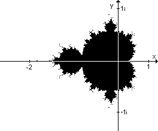

\newpage 

# Leistungsvergleich
Das Ziel dieser Arbeit ist es, einen Leistungsvergleich zwischen WebAssembly und TypeScript durchzuführen. Hierfür werden spezifische Algorithmen verwendet, um die Laufzeit der Anwendung zu messen. Es wurden insgesamt zwei Algorithmen in Rust programmiert, die zu WebAssembly, TypeScript und JavaScript kompiliert wurden. 

## Benchmark Algorithmen
Ein Leistungsvergleich kann gut durch Benchmark-Algorithmen gemessen werden. "Benchmarking eines Software-Systems zielt auf die Bestimmung von Software-Produktmetriken um Systeme vergleichbar zu machen, Leistungsverbesserungen aufzuzeigen, etc." [@schmid_benchmarking_2016]. Dabei ist es wichtig, dass die Ergebnisse des Benchmarkings wiederholbar und reproduzierbar sind. Weitere Informationen zum genau Ablauf und Messung der Algorithmen werden in [Kapitel ???]() weiter erläutert. 


### Matrizenmultiplikation
Ein Anwendungsfall, der auf der WebAssembly-Seite beschrieben wird, ist die Bearbeitung von Bildern und Videos sowie die Verwendung in Spielen, CAD-Anwendungen und VR- und Augmented-Reality-Anwendungen [@noauthor_use_nodate]. All diese Bereiche haben etwas mit computergenerierten Grafiken zu tun. Eine grundlegende Funktion im Bereich der Computergrafik ist das Multiplizieren von Matrizen. Dies wird beispielsweise verwendet, um Geometrien zu transformieren. Dabei beschreibt das Transformieren das Verschieben und Skalieren von Objekten. [@issa_essential_nodate]

#### Theoretischer Aufbau {#matrix:theoretischer_aufbau .unnamed}
Die Matrizenmultiplikation wird durch die folgende mathematische Formel definiert.

Seien $A=(a_{ij})$ und $B=(b_{jk})$ eine Matrix, dann gilt

$$
A * B = C(c_{ij}) \text{  mit  }
c_{ij} := \sum_{k=1}^{n} a_{ik} * b_{jk}
$$

Im Benchmark-Algorithmus werden ausschließlich Matrizen der Größe NxN betrachtet. Eine mögliche Implementierung der Formel in Pseudocode könnte wie folgt aussehen.

```
Data: S[A][B], P[G][H]
Result: Q[][]
for m = 0; m < A; m++ do
  for r = 0; r < H; r++ do
    for k = 0; k < G; k++ do
      Q[m][r] += S[m][k] * P[k][r];
    end 
  end
end
```

Die Matrizenmultiplikation ist ein aufwendiger Algorithmus mit einer Laufzeitkomplexität von $O(n^3)$ aufgrund der verschachtelten `for-loops`. Es gibt jedoch auch weitere Implementierungen wie den `Solvay Strassen` Algorithmus, der die Laufzeit auf $O(n^{2.8074})$ reduziert. In dieser Arbeit wird jedoch der übliche Algorithmus wie oben gezeigt implementiert.
[@datta_matrix_2020]

### Mandelbrot Menge
Ein weiterer Benchmark-Algorithmus, der zur Vergleichbarkeit implementiert wurde, ist die Mandelbrot-Menge. Diese Menge besteht aus komplexen Zahlen, die alle ein bestimmtes Kriterium erfüllen. Es werden nacheinander Punkte innerhalb der komplexen Zahlenmenge durchlaufen und geprüft, ob sie sich in der Mandelbrot-Menge befinden oder nicht. Je öfter diese Punkte durchlaufen werden, desto genauer kann die Mandelbrot-Menge bestimmt werden. [@noauthor_mandelbrotmenge_nodate]

Dieser Benchmark wurde von `The Computer Language Benchmarks Game`^[https://benchmarksgame-team.pages.debian.net/benchmarksgame/index.html] ausgewählt. Die Seite enthält viele Implementierungen spezieller Benchmarks und Vergleiche zwischen verschiedenen Programmiersprachen. Die Benchmarks sind darauf ausgelegt, verschiedene Aspekte wie Geschwindigkeit und Speicher zu testen. Das Paper [@pereira_energy_2017] vergleicht die Energieeffizienz anhand des Benchmarks und erwähnt dabei auch die Benchmarkseite 'The Computer Language Benchmarks Game'. Dieser Benchmark wurde ausgewählt, da er anspruchsvoll ist und intensive numerische Berechnungen erfordert.

#### Theoretischer Aufbau {#mandelbrot:theoretischer_aufbau .unnamed}
Um die Mandelbrot Menge zu bestimmen, wird ein Punkt $C$ aus der komplexen Ebene definiert. In einem Koordinatensystem wie in Abbildung \ref{fig:mandelbrot_kooridnat} gezeigt, wird die x-Achse als Realteil und die y-Achse als Imaginärteil bezeichnet. Somit kann der Punkt $C$ wie folgt dargestellt werden: $C=x+i*y$.

Die Konstante $C$ wird nun immer wieder auf $Z$ angewendet.

$$
Z_{n} = Z_{n-1}^{2} + C
$$

Diese Iteration wird solange ausgeführt, bis der Wert $n$ erreicht ist. Wenn der Wert $Z$ kleiner als 2 ist, wird angenommen, dass der Punkt $C$ in der Mandelbrot-Menge liegt. 



## Benchmark Implementierung
Jeder der oben genannten Benchmarks wird in einer Funktion definiert und in einer Schleife von 1 bis zur Konstante $n$ ausgeführt. Die benötigte Ausführungszeit wird in jeder Iteration gemessen und in einem `BenchmarkReport` gespeichert. Während der Iteration wird ausschließlich die benötigte Zeit für diesen Algorithmus gemessen. Zeiten wie das Befüllen der 'BenchmarkReport'-Liste oder weitere Operationen, die zum Ausführen des Benchmarks benötigt werden, werden nicht mitgemessen. Stattdessen wird die Gesamtzeit aufgenommen, die diese Operationen enthält. Der grobe Aufbau eines Benchmark-Moduls sieht in etwa wie folgt aus.

```
function benchmark(n: Number, reporter: (...args) => void): BenchmarkReport {
  result: BenchmarkReport
  startTime: time.now()
  for i = 1; i <= n; i++ do
    reporter(...args)
    iterStartTime: time.now()
    run() # <-- Hier wird der Benchmark ausgeführt
    iterTime: time.now() - iterStartTime
    result.push({n: i, time: iterTime})
  end
  totalTime: time.now() - startTime
  return result
}
```

### JavaScript und TypeScript
Die Implementierungen von JavaScript und TypeScript unterscheiden sich nur durch die Typisierung von TypeScript. Aus diesem Grund werden die beiden Implementierungen hier zusammen beschrieben. Die Zeit wird durch die Methode `performance.now()` ermittelt.

#### Matrizenmultiplikation {-}
Zu Beginn des Benchmarks werden zwei Matrizen mit der Größe von $NxN$ erstellt. Dabei entspricht $N$ dem aktuellen Index der laufenden Iteration. Die Matrizen werden mit zufälligen Werten befüllt. Zusätzlich zu den beiden Matrizen, die miteinander multipliziert werden, wird eine leere Matrix erstellt, in der das Ergebnis gespeichert wird. Die Erstellung der Matrizen findet in jeder Iteration statt, jedoch noch bevor die Zeit gemessen wird. Die Multiplikation der Matrizen wurde gemäß dem Kapitel [Theoretischer Aufbau des Matrizenalgorithmus](#matrix:theoretischer_aufbau) implementiert.

#### Mandelbrot {-}
JavaScript Version 1, 2 &
TypeScript Version 1, 2, 3, 4

### WebAssembly durch Rust
In Rust wurde ein `trait` namens `Runner` erstellt, welches mehrere Methoden wie `init(), before_iter(), benchmark(), ...` enthält. Dazu gibt es eine Klasse namens `BenchmarkRunner`, welche die Funktionen des `Runner` ausführt. Der Aufbau des `BenchmarkRunner` ist ähnlich zu dem, der oben bereits beschrieben wurde. Jede Benchmark-Implementierung in Rust muss jetzt nur noch `Runner` implementieren und angeben, wie die Benchmark-Funktion aufgerufen werden soll. Die Zeitmessung erfolgt mit dem Paket `instant`^[https://crates.io/crates/instant/0.1.12]. Es ist möglich, auch hier `performance.now()` zu verwenden. Allerdings gab es Schwierigkeiten, da die Benchmarks in einem Web Worker aufgerufen werden. Deshalb wurde hier auf ein externes Paket zurückgegriffen, welches die Zeitmessung in WebAssembly ermöglicht.

#### Matrizenmultiplikation {-}

#### Mandelbrot {-}

## Benchmark Frontend
Um die verschiedenen Benchmark Implementierungen leicht ausführen zu können, wurde ein Frontend entwickelt. Dieses führt die Benchmarks aus und wurde in TypeScript mit React entwickelt. Die verschiedenen Benchmark Implementierungen werden über Module in das Frontend geladen und durch einen Web Worker ausgeführt. Im Frontend kann die Konstante $N$ angegeben werden, welche beschreibt, wie oft eine Benchmark wiederholt werden soll. Diese Konstante wird an die Benchmarkmodule weitergegeben. Das Frontend zeigt eine Übersicht über den aktuellen Benchmark bei $N$, sowie ein Diagramm und eine Tabelle mit den Ergebnissen. Der Benchmark Report, welche von den Benchmark Implementierungen erzeugt wird, kann heruntergeladen werden, um weitere Analysen durchzuführen.

### Web Worker
JavaScript ist eine Single-Threaded Programmiersprache, bedeuetet es kann nur auf einen Thread ausgeführt werden. Dadurch können keine arbeiten parallel durchgeführt werden. Durch sogenannte Web Workers ist es möglich, etwas parallel im Hintergrund Thread laufen zu lassen. Durch einen `MessageBus` kann dann mit dem Haupt-Thread komminiziert werden. [@noauthor_web_2023]

Im Frontend wird der Benchmark in einen Web Worker gestartet. 
