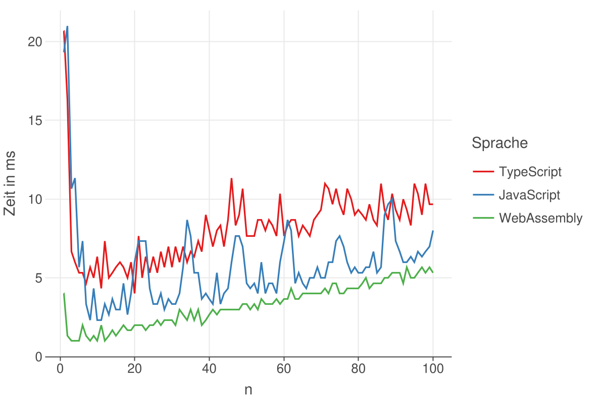

\newpage

# Ergebnisse

## Matrizenmultiplikation
|     Sprache| Browser| Testcomputer|   N| Gesamt in s| Median in ms| Mean in ms|
|------------|--------|-------------|----|------------|-------------|-----------|
|  TypeScript|  Chrome|        Linux| 700|     3232,53|      2289,50|    4617,90|
|  JavaScript|  Chrome|        Linux| 700|     2239,25|      1625,00|    3198,93|
| WebAssmebly|  Chrome|        Linux| 700|     1005,87|       748,33|    1436,96|
|  TypeScript| Firefox|        Linux| 700|     3829,16|      1826,17|    5470,23|
|  JavaScript| Firefox|        Linux| 700|     3758,53|      1953,83|    5369,33|
| WebAssmebly| Firefox|        Linux| 700|      886,18|       677,00|    1265,98|
|  TypeScript|  Safari|      MacBook| 700|     1128,64|       737,17|    1612,35|
|  JavaScript|  Safari|      MacBook| 700|     1132,85|       805,67|    1618,36|
| WebAssmebly|  Safari|      MacBook| 700|      427,48|       278,33|     610,69|
|  TypeScript|  Chrome|      MacBook| 700|     1465,06|       936,50|    2092,95|
|  JavaScript|  Chrome|      MacBook| 700|     1104,53|       753,83|    1577,89|
| WebAssmebly|  Chrome|      MacBook| 700|      532,40|       350,67|     760,57|
|  TypeScript| Firefox|      MacBook| 700|     1358,24|       858,00|    1940,34|
|  JavaScript| Firefox|      MacBook| 700|     1224,69|       778,83|    1749,56|
| WebAssmebly| Firefox|      MacBook| 700|      438,98|       292,83|     627,11|
: Ergebnisse Matrizenmultiplikation

Für den Benchmark-Algorithmus zur Matrizenmultiplikation wurde $N = 700$ gewählt. TypeScript benötigte insgesamt 3232,53 Sekunden für die Ausführung in Chrome auf dem Testcomputer unter Linux. Der Median betrug $2289,50 ms$ und der Durchschnittswert $4617,90 ms$. Bei JavaScript betrug die gesamte Laufzeit 2239,25 Sekunden mit einem Median von $1625 ms$ und einem Durchschnitt von $3198,93 ms$. Bei WebAssembly betrug die Gesamtlaufzeit 1005,87 Sekunden, mit einem Median von $748,33 ms$ und einem Durchschnitt von $1436,96 ms$. In Firefox auf demselben Testcomputer betrug die Gesamtausführungszeit von TypeScript 3829,16 Sekunden, mit einem Median von $1826,17 ms$ und einem Durchschnitt von $5470,23 ms$. Bei JavaScript benötigte der gesamte Benchmark-Algorithmus 3758,53 Sekunden, mit einem Median von $1953,83 ms$ und einem Durchschnitt von $5369,33 ms$. WebAssembly benötigte dabei insgesamt 886,18 Sekunden. Der Median betrug $677 ms$ und der Durchschnitt $1265,98 ms$. Unter Verwendung des Testcomputers MacBook und des Webbrowser Safari benötigte TypeScript insgesamt 1128,64 Sekunden. Der Median betrug $737,17 ms$ und der Durchschnittswert $1612,35 ms$. JavaScript benötigte insgesamt 1132,85 Sekunden, mit einem Median von $805,67 ms$ und einem Durchschnitt von $1618,36 ms$. WebAssembly benötigte insgesamt 427,48 Sekunden, mit einem Median von $278,33 ms$ und einem Durchschnitt von $610,69 ms$. Im Chrome Browser auf dem Testcomputer MacBook benötigte TypeScript insgesamt 1465,06 Sekunden. Der Median betrug $936,50 ms$ und der Durchschnitt $2092,95 ms$. JavaScript benötigte für die gesamte Ausführungszeit 1104,53 Sekunden, mit einem Median von $753,83 ms$ und einem Durchschnittswert von $1577,89 ms$. WebAssembly benötigte insgesamt 532,40 Sekunden, mit einem Median von $350,67 ms$ und einem Durchschnitt von $760,57 ms$. Der Webbrowser Firefox benötigte auf dem Testcomputer MacBook für TypeScript insgesamt 1358,24 Sekunden. Der Median lag bei $858 ms$ und der Durchschnitt bei $1940,34 ms$. Für JavaScript benötigte der Browser insgesamt 1224,69 Sekunden. Die Ausführungszeit betrug im Median $778,83 ms$ und im Durchschnitt $1749,56 ms$. Die Ausführungszeit bei WebAssembly betrug insgesamt 438,98 Sekunden, mit einem Median $292,83 ms$ und im Durchschnitt $627,11 ms$. 

## Mandelbrotmenge
|     Sprache| Browser| Testcomputer|    N| Gesamt in s| Median in ms| Mean in ms|
|------------|--------|-------------|-----|------------|-------------|-----------|
|  TypeScript|  Chrome|        Linux| 5000|      918,07|       182,50|     183,61|
|  JavaScript|  Chrome|        Linux| 5000|     1260,32|       251,17|     252,06|
| WebAssmebly|  Chrome|        Linux| 5000|      674,96|       135,33|     134,99|
|  TypeScript| Firefox|        Linux| 5000|     6950,67|      1406,50|    1390,13|
|  JavaScript| Firefox|        Linux| 5000|     7219,73|      1441,83|    1443,95|
| WebAssmebly| Firefox|        Linux| 5000|      684,19|       137,00|     136,84|
|  TypeScript|  Safari|      MacBook| 5000|     1935,81|       387,33|     387,16|
|  JavaScript|  Safari|      MacBook| 5000|     1732,48|       348,83|     346,50|
| WebAssmebly|  Safari|      MacBook| 5000|      535,29|       106,50|     107,06|
|  TypeScript|  Chrome|      MacBook| 5000|      585,10|       116,33|     117,02|
|  JavaScript|  Chrome|      MacBook| 5000|      539,56|       107,67|     107,91|
| WebAssmebly|  Chrome|      MacBook| 5000|      534,44|       106,00|     106,89|
|  TypeScript| Firefox|      MacBook| 5000|     3844,92|       768,83|     768,98|
|  JavaScript| Firefox|      MacBook| 5000|     4051,49|       808,17|     810,30|
| WebAssmebly| Firefox|      MacBook| 5000|      505,14|       101,00|     101,03|
: Ergebnisse Mandelbrotmenge

Für den Benchmark-Algorithmus zur Mandelbrotmenge wurde ein Wert von $N = 5.000$ gewählt. Unter Verwendung von TypeScript in Chrome auf einem Linux-Testcomputer betrug die Gesamtzeit 918,07 Sekunden, mit einem Median von $182,50 ms$ und einem Durchschnitt von $183,61 ms$. JavaScript benötigte insgesamt 1260,32 Sekunden, mit einem Median von $251,17 ms$ und einem Durchschnitt von $252,06 ms$. WebAssembly benötigte insgesamt 674,96 Sekunden, mit einem Median von $135,33 ms$ und einem Durchschnitt von $134,99$. Im Firefox benötigte der Benchmark für TypeScript insgesamt 6950,67 Sekunden, mit einem Median von $1406,50 ms$ und einem Durchschnitt von $1390,13 ms$. JavaScript benötigte insgesamt 7219,73 Sekunden. Die Laufzeit betrug im Median $1441,83 ms$ und im Durchschnitt $1443,95 ms$. WebAssembly benötigte eine Gesamtlaufzeit von 684,19 Sekunden, mit einem Median von $137 ms$ und einem Durchschnitt von $136,84 ms$. Auf dem MacBook in Safari benötigte TypeScript insgesamt 1935,81 Sekunden, mit einem Median von $387,33 ms$ und einem Durchschnitt von $387,16 ms$. JavaScript benötigte insgesamt 1732,48 Sekunden, mit einem Median von $348,83 ms$ und einem Durchschnittswert von $346,50 ms$. WebAssembly benötigte insgesamt 535,29 Sekunden mit einem Median von $106,50 ms$ und einem Durchschnitt von $107,06 ms$. In Chrome benötigte TypeScript insgesamt 585,10 Sekunden, mit einem Median von $116,33 ms$ und einem Durchschnitt von $117,02 ms$. JavaScript benötigte insgesamt 539,56 Sekunden, mit einem Median von $107,67 ms$ und einem Durchschnittswert von $107,91 ms$. WebAssembly benötigte eine Gesamtlaufzeit von 534,44 Sekunden, mit einem Median von $106 ms$ und einem Durchschnitt von $106,89 ms$. TypeScript in Firefox benötigte insgesamt 3844,92 Sekunden, mit einem Median von $768,83 ms$ und einem Durchschnittswert von $768,98 ms$. JavaScript benötigte insgesamt 4051,49 Sekunden, mit einem Median von $808,17 ms$ und einem Durchschnittswert von $810,30 ms$. WebAssembly benötigte insgesamt 505,14 Sekunden, mit einem Median von $101 ms$ und einem Durchschnitt von $101,03 ms$.

## Interpretation der Ergebnisse
- Relevanz der Forschung für die Forschung und der Praxis

### Matrizenmultiplikation

### Mandelbrotmenge
[@fig:showcase_chrome_frist_100] zeigt sehr gut, wie JavaScript und TypeScript erst noch kompiliert und optimiert werden müssen.

{#fig:showcase_chrome_frist_100}

## Beantwortung der Forschungsfrage
- Bestätigung / Berichtigung der Hypothesen

Grundsätzlich sehen wir, dass WebAssembly in den aller meisten Durchläufen eine kürzere Laufzeit aufweist als JavaScript und TypeScript.
