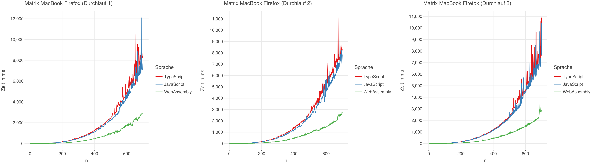
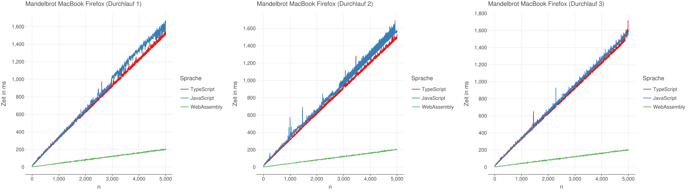
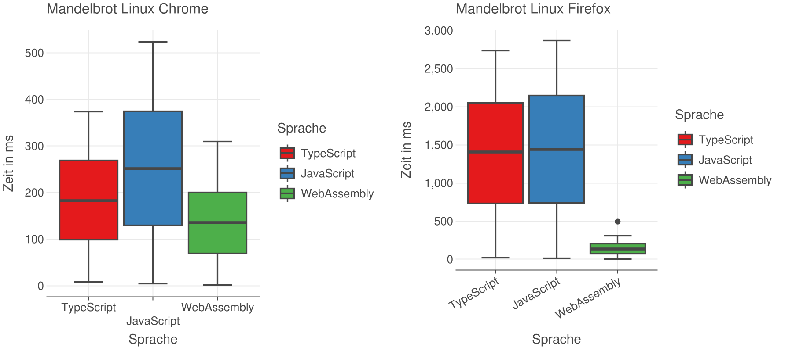

\newpage
\setcounter{page}{1}
\pagenumbering{Roman}
# Anhang {-}

\hypertarget{v8-ignition-bytecode}{
}
\captionof{table}{V8 Ignition Bytecode Ausgabe}
\label{anhang:v8-ignition-bytecode}

\captionof{table}{Ergebnisse Matrizenmultiplikation der drei Durchläufe Linux Chrome}

\captionof{table}{Ergebnisse Matrizenmultiplikation der drei Durchläufe Linux Firefox}

\captionof{table}{Ergebnisse Matrizenmultiplikation der drei Durchläufe MacBook Safari}

\captionof{table}{Ergebnisse Matrizenmultiplikation der drei Durchläufe MacBook Chrome}

\captionof{table}{Ergebnisse Matrizenmultiplikation der drei Durchläufe MacBook Firefox}

\captionof{table}{Ergebnisse Mandelbrotmenge der drei Durchläufe Linux Chrome}

\captionof{table}{Ergebnisse Mandelbrotmenge der drei Durchläufe Linux Firefox}

\captionof{table}{Ergebnisse Mandelbrotmenge der drei Durchläufe MacBook Safari}

\captionof{table}{Ergebnisse Mandelbrotmenge der drei Durchläufe MacBook Chrome}

\captionof{table}{Ergebnisse Mandelbrotmenge der drei Durchläufe MacBook Firefox}

\captionof{table}{Matrix Linux Boxplot Ansicht}

\captionof{table}{Matrix MacBook Boxplot Ansicht}

\captionof{table}{Mandelbrotmenge Linux Boxplot Ansicht}

\captionof{table}{Matrix MacBook Boxplot Ansicht}

