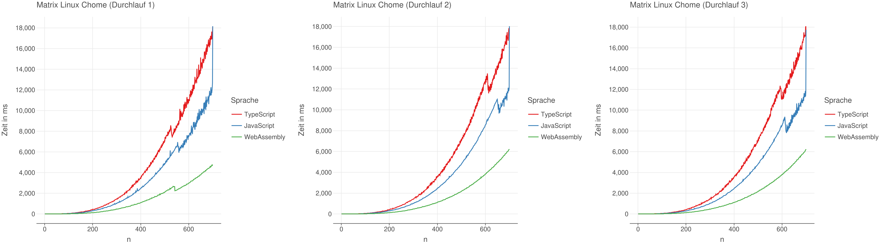

\newpage
\setcounter{page}{1}
\pagenumbering{Roman}
\appendix
# Anhang {-}

\hypertarget{v8-ignition-bytecode}{
}
\captionof{table}{V8 Ignition Bytecode Ausgabe}
\label{anhang:v8-ignition-bytecode}

\captionof{table}{Ergebnisse Matrizenmultiplikation der drei Durchläufe Linux Chrome}

\captionof{table}{Ergebnisse Matrizenmultiplikation der drei Durchläufe Linux Firefox}

\captionof{table}{Ergebnisse Matrizenmultiplikation der drei Durchläufe MacBook Safari}

\captionof{table}{Ergebnisse Matrizenmultiplikation der drei Durchläufe MacBook Chrome}

\captionof{table}{Ergebnisse Matrizenmultiplikation der drei Durchläufe MacBook Firefox}

\captionof{table}{Ergebnisse Mandelbrotmenge der drei Durchläufe Linux Chrome}

\captionof{table}{Ergebnisse Mandelbrotmenge der drei Durchläufe Linux Firefox}

\captionof{table}{Ergebnisse Mandelbrotmenge der drei Durchläufe MacBook Safari}

\captionof{table}{Ergebnisse Mandelbrotmenge der drei Durchläufe MacBook Chrome}

\captionof{table}{Ergebnisse Mandelbrotmenge der drei Durchläufe MacBook Firefox}

\captionof{table}{Matrix Linux Boxplot Ansicht}

\captionof{table}{Matrix MacBook Boxplot Ansicht}

\captionof{table}{Mandelbrotmenge Linux Boxplot Ansicht}

\captionof{table}{Matrix MacBook Boxplot Ansicht}

## Hypothesentest
Die Daten wurden mit DATAtab^[https://datatab.de/] analysiert.

### Matrizenmultiplikation Normalverteilung von Sprachen Daten {#sec:normalverteilt_webbrowser_matrix}
Getestet mit Daten von Macbook Zeitwerten. $\alpha = 5\% = 0.05$.

#### Test auf Normalverteilung WebAssembly
| | Statistik | p |
| --------------- | ------- | ---- |
| Kolmogorov-Smirnov | 0.2 | <0.001 |
| Kolmogorov-Smirnov (Korr. nach Lilliefors) | 0.2 | <0.001|
| Shapiro-Wilk | 0.81 | <0.001 |
| Anderson-Darling | 140.54 | <0.001 |

Es wird angenommen, dass die Daten nicht normalverteilt sind, da $p < \alpha$.

#### Test auf Normalverteilung TypeScript
| | Statistik | p |
| --------------- | ------- | ---- |
| Kolmogorov-Smirnov | 0.2 | <0.001 |
| Kolmogorov-Smirnov (Korr. nach Lilliefors) | 0.2 | <0.001 |
| Shapiro-Wilk | 0.8 | <0.001 |
| Anderson-Darling | 154.19 | <0.001 |

Es wird angenommen, dass die Daten nicht normalverteilt sind, da $p < \alpha$.

#### Test auf Normalverteilung JavaScript
| | Statistik | p |
| --------------- | ------- | ---- |
| Kolmogorov-Smirnov | 0.2 | <0.001 |
| Kolmogorov-Smirnov (Korr. nach Lilliefors) | 0.2 | <0.001 |
| Shapiro-Wilk | 0.81 | <0.001 |
| Anderson-Darling | 148.38 | <0.001 |

Es wird angenommen, dass die Daten nicht normalverteilt sind, da $p < \alpha$.

### Matrizenmultiplikation Normalverteilung von Webbrowser Daten {#sec:normalverteilt_webbrowser_matrix}
Getestet mit Daten von Macbook Zeitwerten. $\alpha = 5\% = 0.05$.

#### Test auf Normalverteilung Chrome
| | Statistik | p |
| --------------- | ------- | ---- |
| Kolmogorov-Smirnov |	0.2 | <0.001 |
| Kolmogorov-Smirnov  (Korr. nach Lilliefors) |	0.2 | <0.001 |
| Shapiro-Wilk | 0.8 | <0.001 |
| Anderson-Darling | 48.68 | <0.001 |

Es wird angenommen, dass die Daten nicht normalverteilt sind, da $p < \alpha$.

#### Test auf Normalverteilung Firefox
| | Statistik | p |
| --------------- | ------- | ---- |
| Kolmogorov-Smirnov | 0.2 | <0.001 |
| Kolmogorov-Smirnov (Korr. nach Lilliefors) | 0.2 | <0.001 |
| Shapiro-Wilk | 0.82 | <0.001 |
| Anderson-Darling | 45.28 | <0.001 |

Es wird angenommen, dass die Daten nicht normalverteilt sind, da $p < \alpha$.

#### Test auf Normalverteilung Safari
| | Statistik | p |
| --------------- | ------- | ---- |
| Kolmogorov-Smirnov | 0.2 | <0.001 |
| Kolmogorov-Smirnov (Korr. nach Lilliefors) | 0.2 | <0.001 |
| Shapiro-Wilk | 0.81 | <0.001 |
| Anderson-Darling | 49.28 | <0.001 |

Es wird angenommen, dass die Daten nicht normalverteilt sind, da $p < \alpha$.

### Mandelbrotmenge Normalverteilung von Webbrowser Daten {#sec:normalverteilt_webbrowser_mandel}
Getestet mit Daten von Macbook Zeitwerten. $\alpha = 5\% = 0.05$.

#### Test auf Normalverteilung Chrome
| | Statistik | p |
| --------------- | ------- | ---- |
| Kolmogorov-Smirnov | 0.06 | <0.001 |
| Kolmogorov-Smirnov (Korr. nach Lilliefors) | 0.06 | <0.001 |
| Shapiro-Wilk | 0.96 | <0.001 |
| Anderson-Darling | 51.79 | <0.001 |

Es wird angenommen, dass die Daten nicht normalverteilt sind, da $p < \alpha$.

#### Test auf Normalverteilung Firefox
| | Statistik | p |
| --------------- | ------- | ---- |
| Kolmogorov-Smirnov | 0.06 | <0.001 |
| Kolmogorov-Smirnov (Korr. nach Lilliefors) | 0.06 | <0.001 |
| Shapiro-Wilk | 0.96 | <0.001 |
| Anderson-Darling | 53.19 | <0.001 |

Es wird angenommen, dass die Daten nicht normalverteilt sind, da $p < \alpha$.

#### Test auf Normalverteilung Safari
| | Statistik | p |
| --------------- | ------- | ---- |
| Kolmogorov-Smirnov | 0.06 | <0.001 |
| Kolmogorov-Smirnov (Korr. nach Lilliefors) | 0.06 | <0.001 |
| Shapiro-Wilk | 0.96 | <0.001 |
| Anderson-Darling | 53.22 | <0.001 |

Es wird angenommen, dass die Daten nicht normalverteilt sind, da $p < \alpha$.

### Berechnungen Matrix Linux WebAssembly zu JavaScript und TypeScript {#sec:comp_wasm_fast_linux}

#### WebAssembly zu TypeScript in Chrome
- $H_0$: Die Gruppe WebAssembly hat kleinere oder gleiche Werte bei der abhängigen Variable wie die Gruppe TypeScript.
- $H_1$: Die Gruppe WebAssembly hat größere Werte bei der abhängigen Variable als die Gruppe TypeScript.

##### Deskriptive Statistiken
|        | n	| Mittelwert | Standardabweichung | Standardfehler Mittelwert |
| ------ | ---- | ---------- | ------------------ | ----------------------- |
| WebAssembly | 700 | 1436.96 | 748.33 | 1607.48 |
| TypeScript | 700 | 4617.9 | 2289.5 | 5114.07 |

##### Mann-Whitney U-Test
| U | z | asymptotisch | p | exakt | p | r |
| --- | ---- | ---- | ---- | ---- | ---- | ---- |
| 165433.5 | -10.52 | 1 | 1 | 0.28 |

Nullhypothese wird angenommen, da $p > \alpha$

#### WebAssembly zu JavaScript in Chrome
- $H_0$: Die Gruppe WebAssembly hat kleinere oder gleiche Werte bei der abhängigen Variable wie die Gruppe JavaScript.
- $H_1$: Die Gruppe WebAssembly hat größere Werte bei der abhängigen Variable als die Gruppe JavaScript.

##### Deskriptive Statistiken
|        | n	| Mittelwert | Standardabweichung | Standardfehler Mittelwert |
| ------ | ---- | ---------- | ------------------ | ----------------------- |
| WebAssembly | 700 | 1436.96 | 748.33 | 1607.48 |
| JavaScript | 700 | 3198.93 | 1625 | 3552.64 |

##### Mann-Whitney U-Test
| U | z | asymptotisch | p | exakt | p | r |
| --- | ---- | ---- | ---- | ---- | ---- | ---- |
| 185919 | -7.81 | 1 | 1 | 0.21 |

Nullhypothese wird angenommen, da $p > \alpha$

#### WebAssembly zu TypeScript in Firefox
- $H_0$: Die Gruppe WebAssembly hat kleinere oder gleiche Werte bei der abhängigen Variable wie die Gruppe TypeScript.
- $H_1$: Die Gruppe WebAssembly hat größere Werte bei der abhängigen Variable als die Gruppe TypeScript.

##### Deskriptive Statistiken
|        | n	| Mittelwert | Standardabweichung | Standardfehler Mittelwert |
| ------ | ---- | ---------- | ------------------ | ----------------------- |
| WebAssembly | 700 | 1265.98 | 677 | 1420.04 |
| TypeScript | 700 | 5470.23 | 1826.17 | 7037.73 |

##### Mann-Whitney U-Test
| U | z | asymptotisch | p | exakt | p | r |
| --- | ---- | ---- | ---- | ---- | ---- | ---- |
| 171393 | -9.73 | 1 | 1 | 0.26 |

Nullhypothese wird angenommen, da $p > \alpha$

#### WebAssembly zu JavaScript in Firefox
- $H_0$: Die Gruppe WebAssembly hat kleinere oder gleiche Werte bei der abhängigen Variable wie die Gruppe JavaScript.
- $H_1$: Die Gruppe WebAssembly hat größere Werte bei der abhängigen Variable als die Gruppe JavaScript.

##### Deskriptive Statistiken
|        | n	| Mittelwert | Standardabweichung | Standardfehler Mittelwert |
| ------ | ---- | ---------- | ------------------ | ----------------------- |
| WebAssembly | 700 | 1265.98 | 677 | 1420.04 |
| JavaScript | 700 | 5369.33 | 1953.83 | 6816.17 |

##### Mann-Whitney U-Test
| U | z | asymptotisch | p | exakt | p | r |
| --- | ---- | ---- | ---- | ---- | ---- | ---- |
| 167722.5 | -10.22 | 1 | 1 | 0.27 |

Nullhypothese wird angenommen, da $p > \alpha$

### Berechnungen Matrix MacBook WebAssembly zu JavaScript und TypeScript {#sec:comp_wasm_fast_macos}

#### WebAssembly zu TypeScript in Safari
- $H_0$: Die Gruppe WebAssembly hat kleinere oder gleiche Werte bei der abhängigen Variable wie die Gruppe TypeScript.
- $H_1$: Die Gruppe WebAssembly hat größere Werte bei der abhängigen Variable als die Gruppe TypeScript.

##### Deskriptive Statistiken
|        | n	| Mittelwert | Standardabweichung | Standardfehler Mittelwert |
| ------ | ---- | ---------- | ------------------ | ----------------------- |
| WebAssembly | 700 | 610.69 | 278.33 | 713.63 |
| TypeScript | 700 | 1612.35 | 737.17 | 1897.05 |

##### Mann-Whitney U-Test
| U | z | asymptotisch | p | exakt | p | r |
| --- | ---- | ---- | ---- | ---- | ---- | ---- |
| 180737 | -8.5 | 1 | 1 | 0.23 |

Nullhypothese wird angenommen, da $p > \alpha$

#### WebAssembly zu JavaScript in Safari
- $H_0$: Die Gruppe WebAssembly hat kleinere oder gleiche Werte bei der abhängigen Variable wie die Gruppe JavaScript.
- $H_1$: Die Gruppe WebAssembly hat größere Werte bei der abhängigen Variable als die Gruppe JavaScript.

##### Deskriptive Statistiken
|        | n	| Mittelwert | Standardabweichung | Standardfehler Mittelwert |
| ------ | ---- | ---------- | ------------------ | ----------------------- |
| WebAssembly | 700 | 610.69 | 278.33 | 713.63 |
| JavaScript | 700 | 1618.36 | 805.67 | 1869.29 |

##### Mann-Whitney U-Test
| U | z | asymptotisch | p | exakt | p | r |
| --- | ---- | ---- | ---- | ---- | ---- | ---- |
| 178399.5 | -8.81 | 1 | 1 | 0.24 |

Nullhypothese wird angenommen, da $p > \alpha$

#### WebAssembly zu TypeScript in Chrome
- $H_0$: Die Gruppe WebAssembly hat kleinere oder gleiche Werte bei der abhängigen Variable wie die Gruppe TypeScript.
- $H_1$: Die Gruppe WebAssembly hat größere Werte bei der abhängigen Variable als die Gruppe TypeScript.

##### Deskriptive Statistiken
|        | n	| Mittelwert | Standardabweichung | Standardfehler Mittelwert |
| ------ | ---- | ---------- | ------------------ | ----------------------- |
| WebAssembly | 700 | 760.57 | 350.67 | 909.29 |
| TypeScript | 700 | 2092.95 | 936.5 | 2477.03 |

##### Mann-Whitney U-Test
| U | z | asymptotisch | p | exakt | p | r |
| --- | ---- | ---- | ---- | ---- | ---- | ---- |
| 178072.5 | -8.85 | 1 | 1 | 0.24 |

Nullhypothese wird angenommen, da $p > \alpha$

#### WebAssembly zu JavaScript in Chrome
- $H_0$: Die Gruppe WebAssembly hat kleinere oder gleiche Werte bei der abhängigen Variable wie die Gruppe JavaScript.
- $H_1$: Die Gruppe WebAssembly hat größere Werte bei der abhängigen Variable als die Gruppe JavaScript.

##### Deskriptive Statistiken
|        | n	| Mittelwert | Standardabweichung | Standardfehler Mittelwert |
| ------ | ---- | ---------- | ------------------ | ----------------------- |
| WebAssembly | 700 | 760.57 | 350.67 | 909.29 |
| JavaScript | 700 | 1577.89 | 753.83 | 1883.05 |

##### Mann-Whitney U-Test
| U | z | asymptotisch | p | exakt | p | r |
| --- | ---- | ---- | ---- | ---- | ---- | ---- |
| 193073 | -6.87 | 1 | 1 | 0.18 |

Nullhypothese wird angenommen, da $p > \alpha$

#### WebAssembly zu TypeScript in Firefox
- $H_0$: Die Gruppe WebAssembly hat kleinere oder gleiche Werte bei der abhängigen Variable wie die Gruppe TypeScript.
- $H_1$: Die Gruppe WebAssembly hat größere Werte bei der abhängigen Variable als die Gruppe TypeScript.

##### Deskriptive Statistiken
|        | n	| Mittelwert | Standardabweichung | Standardfehler Mittelwert |
| ------ | ---- | ---------- | ------------------ | ----------------------- |
| WebAssembly | 700 | 627.11 | 292.83 | 730.76 |
| TypeScript | 700 | 1940.34 | 858 | 2364.21 |

##### Mann-Whitney U-Test
| U | z | asymptotisch | p | exakt | p | r |
| --- | ---- | ---- | ---- | ---- | ---- | ---- |
| 174399.5 | -9.33 | 1 | 1 | 0.25 |

Nullhypothese wird angenommen, da $p > \alpha$

#### WebAssembly zu JavaScript in Firefox
- $H_0$: Die Gruppe WebAssembly hat kleinere oder gleiche Werte bei der abhängigen Variable wie die Gruppe JavaScript.
- $H_1$: Die Gruppe WebAssembly hat größere Werte bei der abhängigen Variable als die Gruppe JavaScript.

##### Deskriptive Statistiken
|        | n	| Mittelwert | Standardabweichung | Standardfehler Mittelwert |
| ------ | ---- | ---------- | ------------------ | ----------------------- |
| WebAssembly | 700 | 627.11 | 292.83 | 730.76 |
| JavaScript | 700 | 1749.56 | 778.83 | 2132.27 |

##### Mann-Whitney U-Test
| U | z | asymptotisch | p | exakt | p | r |
| --- | ---- | ---- | ---- | ---- | ---- | ---- |
| 178891 | -8.74 | 1 | 1 | 0.23 |

Nullhypothese wird angenommen, da $p > \alpha$

### Berechnungen Mandelbrot Linux WebAssembly zu JavaScript und TypeScript {#sec:comp_wasm_fast_linux_mandel}

#### WebAssembly zu TypeScript in Chrome
- $H_0$: Die Gruppe WebAssembly hat kleinere oder gleiche Werte bei der abhängigen Variable wie die Gruppe TypeScript.
- $H_1$: Die Gruppe WebAssembly hat größere Werte bei der abhängigen Variable als die Gruppe TypeScript.

##### Deskriptive Statistiken
|        | n	| Mittelwert | Standardabweichung | Standardfehler Mittelwert |
| ------ | ---- | ---------- | ------------------ | ----------------------- |
| WebAssembly | 5000 | 134.99 | 135.33 | 76.13 |
| TypeScript | 5000 | 183.61 | 182.5 | 98.71 |

##### Mann-Whitney U-Test
| U | z | asymptotisch | p | exakt | p | r |
| --- | ---- | ---- | ---- | ---- | ---- | ---- |
| 8951718.5 | -24.58 | 1 | 1 | 0.25 |

Nullhypothese wird angenommen, da $p > \alpha$

#### WebAssembly zu JavaScript in Chrome
- $H_0$: Die Gruppe WebAssembly hat kleinere oder gleiche Werte bei der abhängigen Variable wie die Gruppe JavaScript.
- $H_1$: Die Gruppe WebAssembly hat größere Werte bei der abhängigen Variable als die Gruppe JavaScript.

##### Deskriptive Statistiken
|        | n	| Mittelwert | Standardabweichung | Standardfehler Mittelwert |
| ------ | ---- | ---------- | ------------------ | ----------------------- |
| WebAssembly | 5000 | 134.99 | 135.33 | 76.13 |
| JavaScript | 5000 | 252.06 | 251.17 | 141.6 |

##### Mann-Whitney U-Test
| U | z | asymptotisch | p | exakt | p | r |
| --- | ---- | ---- | ---- | ---- | ---- | ---- |
| 6528354 | -41.37 | 1 | 1 | 0.41 |

Nullhypothese wird angenommen, da $p > \alpha$

#### WebAssembly zu TypeScript in Firefox
- $H_0$: Die Gruppe WebAssembly hat kleinere oder gleiche Werte bei der abhängigen Variable wie die Gruppe TypeScript.
- $H_1$: Die Gruppe WebAssembly hat größere Werte bei der abhängigen Variable als die Gruppe TypeScript.

##### Deskriptive Statistiken
|        | n	| Mittelwert | Standardabweichung | Standardfehler Mittelwert |
| ------ | ---- | ---------- | ------------------ | ----------------------- |
| WebAssembly | 5000 | 136.84 | 137 | 77.34 |
| TypeScript | 5000 | 1390.13 | 1406.5 | 768.35 |

##### Mann-Whitney U-Test
| U | z | asymptotisch | p | exakt | p | r |
| --- | ---- | ---- | ---- | ---- | ---- | ---- |
| 1000774.5 | -79.67 | 1 | 1 | 0.8 |

Nullhypothese wird angenommen, da $p > \alpha$

#### WebAssembly zu JavaScript in Firefox
- $H_0$: Die Gruppe WebAssembly hat kleinere oder gleiche Werte bei der abhängigen Variable wie die Gruppe JavaScript.
- $H_1$: Die Gruppe WebAssembly hat größere Werte bei der abhängigen Variable als die Gruppe JavaScript.

##### Deskriptive Statistiken
|        | n	| Mittelwert | Standardabweichung | Standardfehler Mittelwert |
| ------ | ---- | ---------- | ------------------ | ----------------------- |
| WebAssembly | 5000 | 136.84 | 137 | 77.34 |
| JavaScript | 5000 | 1443.95 | 1441.83 | 812.48 |

##### Mann-Whitney U-Test
| U | z | asymptotisch | p | exakt | p | r |
| --- | ---- | ---- | ---- | ---- | ---- | ---- |
| 994778 | -79.71 | 1 | 1 | 0.8 |

Nullhypothese wird angenommen, da $p > \alpha$

### Berechnungen Mandelbrot MacBook WebAssembly zu JavaScript und TypeScript {#sec:comp_wasm_fast_macos_mandel}

#### WebAssembly zu TypeScript in Safari
- $H_0$: Die Gruppe WebAssembly hat kleinere oder gleiche Werte bei der abhängigen Variable wie die Gruppe TypeScript.
- $H_1$: Die Gruppe WebAssembly hat größere Werte bei der abhängigen Variable als die Gruppe TypeScript.

##### Deskriptive Statistiken
|        | n	| Mittelwert | Standardabweichung | Standardfehler Mittelwert |
| ------ | ---- | ---------- | ------------------ | ----------------------- |
| WebAssembly | 5000 | 107.06 | 106.5 | 60.63 |
| TypeScript | 5000 | 387.16 | 387.33 | 213.04 |

##### Mann-Whitney U-Test
| U | z | asymptotisch | p | exakt | p | r |
| --- | ---- | ---- | ---- | ---- | ---- | ---- |
| 3032267 | -65.59 | 1 | 1 | 0.66 |

Nullhypothese wird angenommen, da $p > \alpha$

#### WebAssembly zu JavaScript in Safari
- $H_0$: Die Gruppe WebAssembly hat kleinere oder gleiche Werte bei der abhängigen Variable wie die Gruppe JavaScript.
- $H_1$: Die Gruppe WebAssembly hat größere Werte bei der abhängigen Variable als die Gruppe JavaScript.

##### Deskriptive Statistiken
|        | n	| Mittelwert | Standardabweichung | Standardfehler Mittelwert |
| ------ | ---- | ---------- | ------------------ | ----------------------- |
| WebAssembly | 5000 | 107.06 | 106.5 | 60.63 |
| JavaScript | 5000 | 346.5 | 348.83 | 192.33 |

##### Mann-Whitney U-Test
| U | z | asymptotisch | p | exakt | p | r |
| --- | ---- | ---- | ---- | ---- | ---- | ---- |
| 3564824.5 | -61.9 | 1 | 1 | 0.62 |

Nullhypothese wird angenommen, da $p > \alpha$

#### WebAssembly zu TypeScript in Chrome
- $H_0$: Die Gruppe WebAssembly hat kleinere oder gleiche Werte bei der abhängigen Variable wie die Gruppe TypeScript.
- $H_1$: Die Gruppe WebAssembly hat größere Werte bei der abhängigen Variable als die Gruppe TypeScript.

##### Deskriptive Statistiken
|        | n	| Mittelwert | Standardabweichung | Standardfehler Mittelwert |
| ------ | ---- | ---------- | ------------------ | ----------------------- |
| WebAssembly | 5000 | 106.89 | 106 | 61.31 |
| TypeScript | 5000 | 117.02 | 116.33 | 64.82 |

##### Mann-Whitney U-Test
| U | z | asymptotisch | p | exakt | p | r |
| --- | ---- | ---- | ---- | ---- | ---- | ---- |
| 11377895 | -7.77 | 1 | 1 | 0.08 |

Nullhypothese wird angenommen, da $p > \alpha$

#### WebAssembly zu JavaScript in Chrome
- $H_0$: Die Gruppe WebAssembly hat kleinere oder gleiche Werte bei der abhängigen Variable wie die Gruppe JavaScript.
- $H_1$: Die Gruppe WebAssembly hat größere Werte bei der abhängigen Variable als die Gruppe JavaScript.

##### Deskriptive Statistiken
|        | n	| Mittelwert | Standardabweichung | Standardfehler Mittelwert |
| ------ | ---- | ---------- | ------------------ | ----------------------- |
| WebAssembly | 5000 | 106.89 | 106 | 61.31 |
| JavaScript | 5000 | 107.91 | 107.67 | 60.21 |

##### Mann-Whitney U-Test
| U | z | asymptotisch | p | exakt | p | r |
| --- | ---- | ---- | ---- | ---- | ---- | ---- |
| 12363809.5 | -0.94 | 0.827 | 0.827 | 0.01 |

Nullhypothese wird angenommen, da $p > \alpha$

#### WebAssembly zu TypeScript in Firefox
- $H_0$: Die Gruppe WebAssembly hat kleinere oder gleiche Werte bei der abhängigen Variable wie die Gruppe TypeScript.
- $H_1$: Die Gruppe WebAssembly hat größere Werte bei der abhängigen Variable als die Gruppe TypeScript.

##### Deskriptive Statistiken
|        | n	| Mittelwert | Standardabweichung | Standardfehler Mittelwert |
| ------ | ---- | ---------- | ------------------ | ----------------------- |
| WebAssembly | 5000 | 101.03 | 101 | 57.43 |
| TypeScript | 5000 | 768.98 | 768.83 | 431.77 |

##### Mann-Whitney U-Test
| U | z | asymptotisch | p | exakt | p | r |
| --- | ---- | ---- | ---- | ---- | ---- | ---- |
| 1414378 | -76.8 | 1 | 1 | 0.77 |

Nullhypothese wird angenommen, da $p > \alpha$

#### WebAssembly zu JavaScript in Firefox
- $H_0$: Die Gruppe WebAssembly hat kleinere oder gleiche Werte bei der abhängigen Variable wie die Gruppe JavaScript.
- $H_1$: Die Gruppe WebAssembly hat größere Werte bei der abhängigen Variable als die Gruppe JavaScript.

##### Deskriptive Statistiken
|        | n	| Mittelwert | Standardabweichung | Standardfehler Mittelwert |
| ------ | ---- | ---------- | ------------------ | ----------------------- |
| WebAssembly | 5000 | 101.03 | 101 | 57.43 |
| JavaScript | 5000 | 810.3 | 808.17 | 461.06 |

##### Mann-Whitney U-Test
| U | z | asymptotisch | p | exakt | p | r |
| --- | ---- | ---- | ---- | ---- | ---- | ---- |
| 1367806 | -77.12 | 1 | 1 | 0.77 |

Nullhypothese wird angenommen, da $p > \alpha$

### Berechnungen Matrix MacBook Webbrowser {#sec:htest_matrix_macbook_browser}

#### Kruskal-Wallis Test {#sec:anova_matrix_macbook_browser}
- $H_0$: Es gibt keinen Unterschied zwischen den 3 Kategorien der unabhängigen Variable in Bezug auf die abhängige Variable
- $H_1$: Es gibt einen Unterschied zwischen den 3 Kategorien der unabhängigen Variable in Bezug auf die abhängige Variable

##### Ränge
| Gruppe | n | Median | Mittlerer Rang |
| ------ | ---- | ------ | ------- |
| Chrome  | 700 | 350.67 | 1092.5 |
| Firefox | 700 | 292.83 | 1035.37 |
| Safari  | 700 | 278.33 | 1023.63 |
| Gesamt  | 2100 | 307.67 | |

##### Kruskal-Wallis-Test
| $Chi^2$ | df | p |
| ------- | --- | ---- |
| 5.17 | 2 | 0.075 |

Nullhypothese wird angenommen, da $p > \alpha$

### Berechnungen Matrix Linux Webbrowser {#sec:htest_matrix_linux_browser}
- $H_0$: Es gibt keinen Unterschied zwischen den Gruppen Chrome und Firefox in Bezug auf die abhängige Variable
- $H_1$: Es gibt einen Unterschied zwischen den Gruppen Chrome und Firefox in Bezug auf die abhängigen Variable

##### Deskriptive Statistiken
|        | n	| Mittelwert | Standardabweichung | Standardfehler Mittelwert |
| ------ | ---- | ---------- | ------------------ | ----------------------- |
| Chrome | 700 | 1436.96 | 748.33 | 1607.48 |
| Firefox | 700 | 1265.98 | 677 | 1420.04 |

##### Mann-Whitney U-Test
| U | z | asymptotisch | p | exakt | p | r |
| --- | ---- | ---- | ---- | ---- | ---- | ---- |
| 234597.5 | -1.38 | 0.169 | 0.169 | 0.04 |

Nullhypothese wird angenommen, da $p > \alpha$

### Berechnungen Mandelbrotmenge MacBook Webbrowser {#sec:htest_mandel_macbook_browser}

#### Kruskal-Wallis Test {#sec:anova_mandel_macbook_browser}
- $H_0$: Es gibt keinen Unterschied zwischen den 3 Kategorien der unabhängigen Variable in Bezug auf die abhängige Variable
- $H_1$: Es gibt einen Unterschied zwischen den 3 Kategorien der unabhängigen Variable in Bezug auf die abhängige Variable

##### Ränge
| Gruppe | n | Median | Mittlerer Rang |
| ------ | ---- | ------ | ------- |
| Chrome  | 5000 | 106 | 7628.12 |
| Firefox | 5000 | 101 | 7223.94 |
| Safari  | 5000 | 106.5 | 7649.44 |
| Gesamt  | 15000 | 104.5 | |

##### Kruskal-Wallis-Test
| $Chi^2$ | df | p |
| ------- | --- | ---- |
| 30.65 | 2 | <0.001 |

Nullhypothese wird abgelehnt, da $p < \alpha$

##### Post-hoc-Test
| | Teststatistik | Standardfehler| Std. Teststatistik | p | Anp. p |
| ---------------- | ------- | ------ | ----- | ------- | ----- |
| Chrome - Firefox | 404.18 | 86.61 | 4.67 | <0.001 | <0.001 |
| Chrome - Safari  | -21.32 | 86.61 | -0.25 | 0.806 | 1 |
| Firefox - Safari | -425.5 | 86.61 | -4.91 | <0.001 | <0.001 |

Es scheint einen signifikanten Unterschied zwischen Safari und Firefox sowie zwischen Chrome und Firefox zu geben, nicht aber zwischen Chrome und Safari.

#### u-Test zwischen Chrome und Safari {#sec:utest_mandel_macbook_browser_safari_chrome}
- $H_0$: Es gibt keinen Unterschied zwischen den Gruppen Chrome und Safari in Bezug auf die abhängige Variable
- $H_1$: Es gibt einen Unterschied zwischen den Gruppen Chrome und Safari in Bezug auf die abhängigen Variable

##### Deskriptive Statistiken
|        | n	| Mittelwert | Standardabweichung | Standardfehler Mittelwert |
| ------ | ---- | ---------- | ------------------ | ----------------------- |
| Chrome | 5000 | 106.89 | 106 | 61.31 |
| Safari | 5000 | 107.06 | 106.5 | 60.63 |

##### Mann-Whitney U-Test
| U | z | asymptotisch | p | exakt | p | r |
| --- | ---- | ---- | ---- | ---- | ---- | ---- |
| 12467040 | -0.23 | 0.819 | 0.819 | 0 |

Nullhypothese wird angenommen, da $p > \alpha$

### Berechnungen Mandelbrotmenge Linux Webbrowser {#sec:htest_mandel_linux_browser}
- $H_0$: Es gibt keinen Unterschied zwischen den Gruppen Chrome und Firefox in Bezug auf die abhängige Variable
- $H_1$: Es gibt einen Unterschied zwischen den Gruppen Chrome und Firefox in Bezug auf die abhängigen Variable

##### Deskriptive Statistiken
|        | n	| Mittelwert | Standardabweichung | Standardfehler Mittelwert |
| ------ | ---- | ---------- | ------------------ | ----------------------- |
| Chrome | 5000 | 134.99 | 135.33 | 76.13 |
| Firefox | 5000 | 136.84 | 137 | 77.34 |

##### Mann-Whitney U-Test
| U | z | asymptotisch | p | exakt | p | r |
| --- | ---- | ---- | ---- | ---- | ---- | ---- |
| 12326828.5 | -1.2 | 0.23 | 0.23 | 0.01 |

Nullhypothese wird angenommen, da $p > \alpha$

